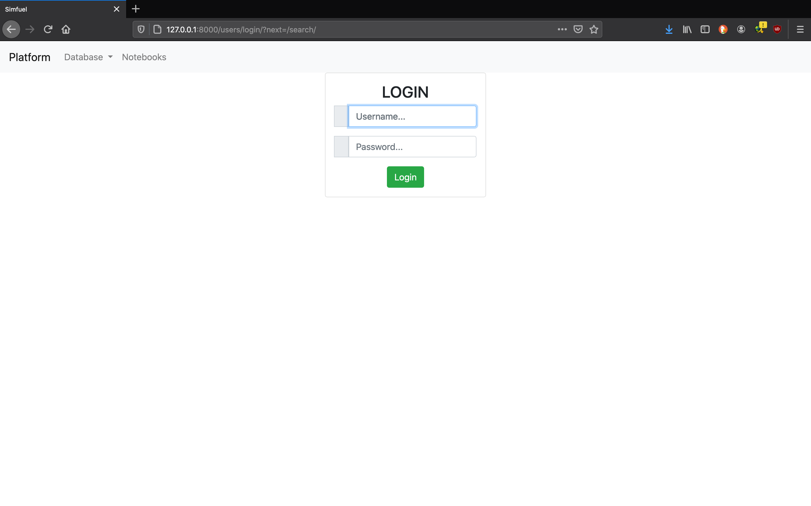
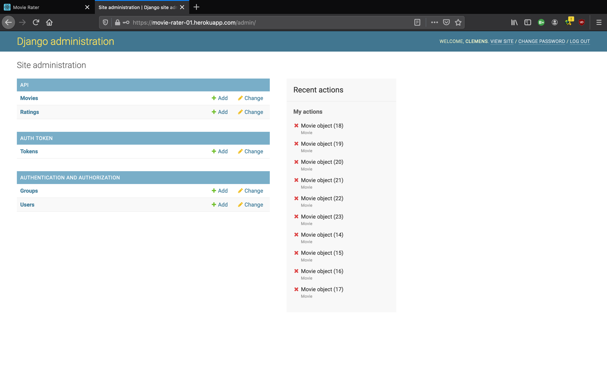
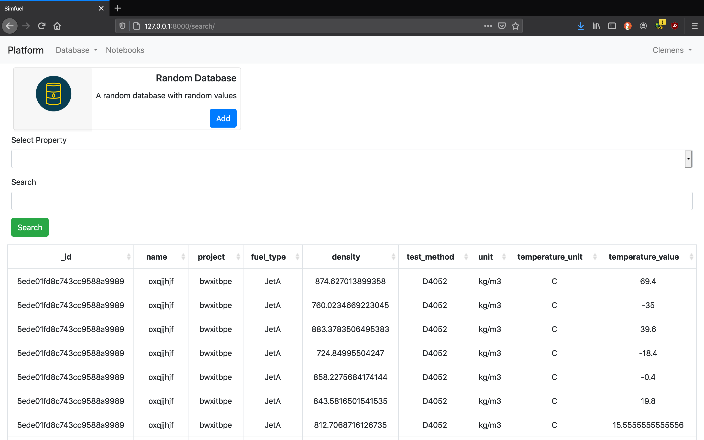
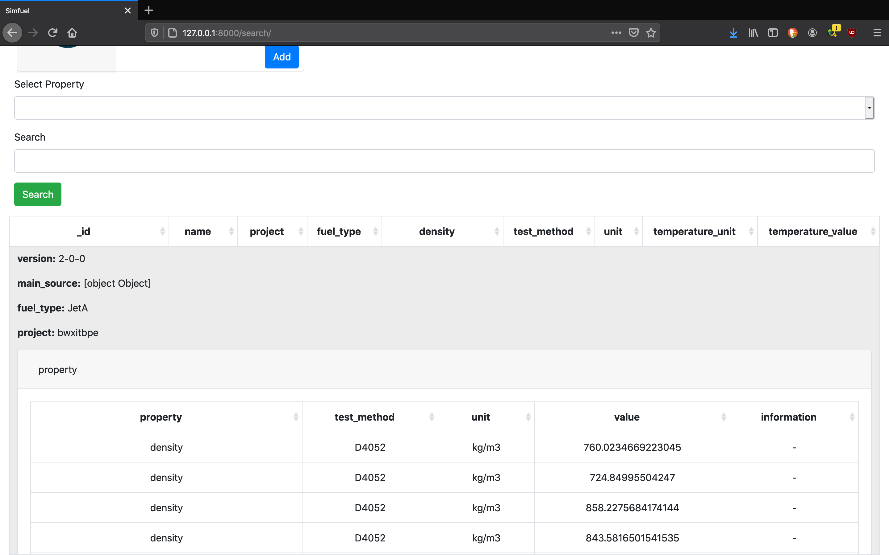
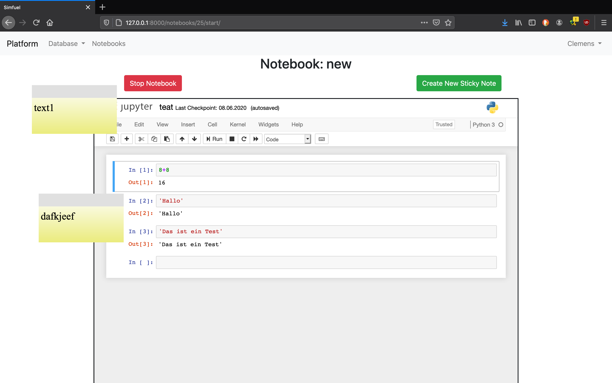

# django platform
This repo contains the code for a webplatform comprised of applications for:
	- quering of a bound MongoDB database for chemo-physical data of chemical mixtures
	- registration of database collections
	- cooperative work with jupyther workbooks and with sticky note annotation
	- user management

The database is based on django using a postgres database for user and platform data as well as an additional MongoDB database for the data of the chemical mixtures. The videos and pictures below show the general functionality of the platform.

This repo is for demonstrational purposes only. The platform will NOT run solely with the code of this repository but needs the addional postres and MongoDB database. The databases need to be connected in the code of the platform.

File / Folder | Description
assets | images and gif for Readme
django_simfuel | django code (python, javascript, html)
DummyDB | folder with dummy data to load into the MongoDB database
crate_dummy_database.py | python file to create dummy data of chemical mixtures
Readme | readme
requirements.txt | python requirements

